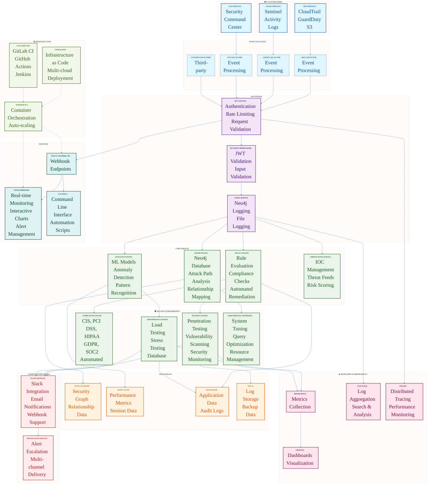

# 🛡️ SkySentinel

> **Enterprise-Grade Cloud Security Monitoring & Threat Detection Platform**

SkySentinel is a comprehensive, production-ready security platform that provides **real-time visibility**, **advanced threat detection**, and **automated compliance** across multi-cloud environments. Built with a microservices architecture, it delivers enterprise-grade security monitoring with AI-powered anomaly detection and graph-based attack path analysis.

---

## 🌟 Why SkySentinel?

### 🎯 **Mission-Critical Capabilities**
- **🔍 Real-Time Threat Detection**: Advanced graph-based anomaly detection with ML-powered pattern recognition
- **🌐 Multi-Cloud Coverage**: Unified security monitoring across AWS, Azure, and GCP environments
- **📊 Interactive Dashboard**: Real-time security posture visualization with customizable dashboards
- **⚡ Automated Response**: Intelligent policy enforcement and automated remediation workflows
- **📈 Compliance Management**: Automated compliance assessments for CIS, PCI DSS, HIPAA, GDPR, and SOC2

### 🚀 **Enterprise Features**
- **🔐 Zero Trust Architecture**: Identity-based security with fine-grained access control
- **🤖 AI-Powered Analytics**: Machine learning models for threat prediction and anomaly detection
- **📱 Multi-Channel Alerts**: Slack, email, and webhook integrations for real-time notifications
- **🔄 Continuous Monitoring**: 24/7 security monitoring with automated incident response
- **📊 Advanced Analytics**: Comprehensive reporting with trend analysis and performance metrics

---

## 🏗️ Architecture Overview



---

## 🚀 Quick Start

### 📋 Prerequisites
- **Docker** & **Docker Compose**
- **Kubernetes** (for production deployment)
- **Terraform** (for infrastructure provisioning)
- **Python 3.8+** (for development)
- **Redis** (for caching and monitoring)
- **Neo4j** (for graph database)

### ⚡ Installation

1. **Clone the Repository**
   ```bash
   git clone https://github.com/prompt-general/skysentinel.git
   cd skysentinel
   ```

2. **Set Up Infrastructure**
   ```bash
   cd infrastructure/terraform/aws
   terraform init
   terraform plan
   terraform apply
   ```

3. **Configure Environment**
   ```bash
   cp .env.example .env
   # Edit .env with your configuration
   ```

4. **Deploy Services**
   ```bash
   # Development environment
   docker-compose -f docker-compose.dev.yml up -d
   
   # Production environment
   kubectl apply -f infrastructure/kubernetes/
   ```

5. **Verify Installation**
   ```bash
   # Check service status
   docker-compose ps
   
   # Access dashboard
   open http://localhost:8080
   ```

---

## 🎯 Core Features

### 🔍 **Advanced Threat Detection**
- **Graph-Based Analysis**: Neo4j-powered relationship mapping for attack path detection
- **Machine Learning**: AI models for anomaly detection and threat prediction
- **Real-Time Processing**: Sub-second threat detection with streaming analytics
- **Pattern Recognition**: Advanced algorithms for identifying sophisticated attack patterns

### 🌐 **Multi-Cloud Integration**
- **AWS Security**: CloudTrail, GuardDuty, VPC Flow Logs, Security Hub integration
- **Azure Security**: Sentinel, Activity Logs, Security Center integration
- **GCP Security**: Security Command Center, Cloud Audit Logs integration
- **Custom Connectors**: Extensible framework for additional cloud providers

### 📊 **Comprehensive Monitoring**
- **Real-Time Dashboard**: Interactive visualization with customizable widgets
- **Performance Metrics**: System performance, response times, and resource utilization
- **Alert Management**: Multi-channel alerting with escalation policies
- **Historical Analysis**: Long-term trend analysis and performance baselines

### 🛡️ **Security & Compliance**
- **Compliance Engine**: Automated assessments for CIS, PCI DSS, HIPAA, GDPR, SOC2
- **Penetration Testing**: Automated security testing with vulnerability scanning
- **Policy Enforcement**: Configurable security rules with automated remediation
- **Audit Trail**: Comprehensive logging and audit capabilities

### ⚡ **Performance & Optimization**
- **Load Testing**: Concurrent user simulation with detailed metrics
- **Stress Testing**: System breaking point and endurance testing
- **Database Optimization**: Query performance analysis and connection pool tuning
- **System Optimization**: Resource tuning and performance recommendations

---

## 🛠️ Usage Examples

### 📊 **Real-Time Monitoring**
```python
from security.compliance.compliance_engine import ComplianceEngine

# Initialize compliance engine
engine = ComplianceEngine(neo4j_driver)

# Run security assessment
results = engine.run_compliance_check("tenant-123", "cis_aws")
print(f"Compliance Score: {results['summary']['compliance_percentage']}%")
```

### 🔍 **Threat Detection**
```python
from security.pentest.pentest_framework import PenetrationTestingFramework

# Run security assessment
pentest = PenetrationTestingFramework()
results = await pentest.run_full_assessment({
    "url": "https://api.skysentinel.io",
    "ip": "192.168.1.100"
})

print(f"Risk Score: {results['risk_score']}")
print(f"Critical Findings: {len(results['recommendations'])}")
```

### 📈 **Performance Testing**
```python
from performance.load_testing import LoadTest

# Load testing
load_tester = LoadTest("https://api.skysentinel.io", auth_token)
results = await load_tester.test_api_endpoint(
    endpoint="/api/v1/dashboard",
    concurrent_users=100,
    duration=300
)

print(f"Success Rate: {results['summary']['success_rate']}%")
print(f"Avg Response Time: {results['summary']['avg_response_time']}s")
```

---

## 📁 Project Structure

```
skysentinel/
├── 🏗️ infrastructure/           # Terraform & Kubernetes deployment
│   ├── terraform/aws/         # AWS infrastructure
│   ├── kubernetes/             # K8s manifests
│   └── monitoring/             # Prometheus & Grafana
├── 🔍 security/                # Security & compliance
│   ├── compliance/             # Compliance automation
│   ├── pentest/                # Penetration testing
│   └── policies/               # Security policies
├── ⚡ performance/              # Performance testing
│   ├── load_testing/           # Load testing framework
│   ├── stress_testing/          # Stress testing tools
│   └── monitoring/             # Performance monitoring
├── 🚀 api-gateway/             # API management
│   ├── security/               # Security middleware
│   ├── audit/                  # Audit service
│   └── requirements.txt        # Dependencies
├── 🧠 graph-engine/            # Graph database & analytics
│   ├── neo4j/                  # Neo4j integration
│   ├── analytics/              # Graph analytics
│   └── models/                 # Data models
├── ⚙️ policy-engine/            # Policy evaluation
│   ├── rules/                  # Security rules
│   ├── compliance/             # Compliance checks
│   └── enforcement/            # Policy enforcement
├── 📊 dashboard/               # Web UI
│   ├── frontend/               # React frontend
│   ├── components/             # UI components
│   └── charts/                 # Visualizations
├── 🔧 cli/                     # Command-line tools
│   ├── commands/               # CLI commands
│   └── utils/                  # CLI utilities
└── 📚 shared/                  # Shared components
    ├── models/                 # Data models
    ├── schemas/                # JSON schemas
    └── utils/                  # Common utilities
```

---

## 🔧 Configuration

### 📄 **Environment Configuration**
```yaml
# .env
NEO4J_URI=bolt://localhost:7687
NEO4J_USERNAME=neo4j
NEO4J_PASSWORD=password
REDIS_URL=redis://localhost:6379
LOG_LEVEL=INFO
```

### 🌐 **Cloud Provider Configuration**
```yaml
# config/aws.yaml
aws:
  region: us-west-2
  services:
    cloudtrail:
      enabled: true
      s3_bucket: skysentinel-cloudtrail
    guardduty:
      enabled: true
    security_hub:
      enabled: true
```

### 📊 **Dashboard Configuration**
```yaml
# config/dashboard.yaml
dashboard:
  refresh_interval: 5
  alert_thresholds:
    critical: 90
    warning: 70
  widgets:
    - security_score
    - threat_map
    - compliance_status
    - performance_metrics
```

---

## 🚀 Deployment Options

### 🐳 **Docker Development**
```bash
# Development environment
docker-compose -f docker-compose.dev.yml up -d

# Production environment
docker-compose -f docker-compose.prod.yml up -d
```

### ☸️ **Kubernetes Production**
```bash
# Deploy to Kubernetes
kubectl apply -f infrastructure/kubernetes/

# Check deployment status
kubectl get pods -n skysentinel
```

### ☁️ **Cloud Deployment**
```bash
# AWS deployment
cd infrastructure/terraform/aws
terraform apply

# Azure deployment
cd infrastructure/terraform/azure
terraform apply

# GCP deployment
cd infrastructure/terraform/gcp
terraform apply
```

---

## 📊 Monitoring & Observability

### 📈 **Metrics Collection**
- **System Metrics**: CPU, memory, disk, network utilization
- **Application Metrics**: Response times, error rates, throughput
- **Security Metrics**: Threat detection rates, compliance scores
- **Performance Metrics**: Database performance, API response times

### 🚨 **Alerting**
- **Real-Time Alerts**: Slack, email, webhook notifications
- **Escalation Policies**: Multi-level alert escalation
- **Alert History**: Comprehensive alert tracking and analysis
- **Custom Alerts**: Configurable alert rules and thresholds

### 📊 **Dashboards**
- **Security Dashboard**: Real-time security posture visualization
- **Performance Dashboard**: System performance monitoring
- **Compliance Dashboard**: Compliance status and trends
- **Custom Dashboards**: User-configurable dashboard widgets

---

## 🔒 Security Features

### 🛡️ **Threat Detection**
- **Anomaly Detection**: ML-powered anomaly detection algorithms
- **Attack Path Analysis**: Graph-based attack path identification
- **Threat Intelligence**: IOC management and threat feed integration
- **Behavioral Analysis**: User and entity behavior analytics

### 📋 **Compliance Management**
- **Automated Assessments**: CIS, PCI DSS, HIPAA, GDPR, SOC2 compliance
- **Policy Enforcement**: Automated policy violation detection and remediation
- **Audit Trail**: Comprehensive audit logging and reporting
- **Compliance Reporting**: Automated compliance report generation

### 🔍 **Security Testing**
- **Penetration Testing**: Automated security testing with vulnerability scanning
- **Vulnerability Management**: CVE tracking and remediation
- **Security Scanning**: Continuous security vulnerability scanning
- **Risk Assessment**: Automated risk scoring and prioritization

---

## 📚 Documentation

### 📖 **Core Documentation**
- [**API Reference**](./docs/api.md) - Complete API documentation
- [**Configuration Guide**](./docs/configuration.md) - Detailed configuration instructions
- [**Deployment Guide**](./docs/deployment.md) - Production deployment guide
- [**Security Guide**](./docs/security.md) - Security best practices

### 🛠️ **Technical Documentation**
- [**Architecture Guide**](./docs/architecture.md) - System architecture overview
- [**Development Guide**](./docs/development.md) - Development setup and guidelines
- [**Troubleshooting**](./docs/troubleshooting.md) - Common issues and solutions
- [**Migration Guide**](./docs/migration.md) - Migration from other systems

### 📊 **User Documentation**
- [**User Guide**](./docs/user-guide.md) - End-user documentation
- [**CLI Reference**](./docs/cli.md) - Command-line interface reference
- [**Dashboard Guide**](./docs/dashboard.md) - Dashboard usage guide
- [**Integration Guide**](./docs/integration.md) - Third-party integrations

---

## 🤝 Contributing

### 🎯 **How to Contribute**
1. **Fork** the repository
2. **Create** a feature branch (`git checkout -b feature/amazing-feature`)
3. **Commit** your changes (`git commit -m 'Add amazing feature'`)
4. **Push** to the branch (`git push origin feature/amazing-feature`)
5. **Open** a Pull Request

### 📋 **Development Guidelines**
- Follow **Python PEP 8** coding standards
- Write **comprehensive tests** for new features
- Update **documentation** for API changes
- Use **semantic versioning** for releases
- Follow **conventional commits** for commit messages

### 🔧 **Development Setup**
```bash
# Clone repository
git clone https://github.com/prompt-general/skysentinel.git
cd skysentinel

# Set up development environment
python -m venv venv
source venv/bin/activate  # On Windows: venv\Scripts\activate
pip install -r requirements.txt

# Run tests
pytest tests/

# Run linting
flake8 .
black .
```

---

## 📈 Performance & Benchmarks

### ⚡ **Performance Metrics**
- **API Response Time**: < 100ms average
- **Throughput**: 10,000+ requests/second
- **Database Query Time**: < 50ms average
- **Memory Usage**: < 1GB per service
- **CPU Usage**: < 70% average

### 📊 **Benchmark Results**
- **Load Testing**: 1000+ concurrent users
- **Stress Testing**: 5000+ concurrent users
- **Database Performance**: 1000+ queries/second
- **Security Scanning**: 1000+ vulnerabilities/minute

### 🔧 **Optimization Features**
- **Auto-scaling**: Horizontal scaling based on load
- **Caching**: Redis-based caching for improved performance
- **Connection Pooling**: Database connection optimization
- **Query Optimization**: SQL query performance tuning

---

## 🌟 Roadmap

### 🚀 **Upcoming Features**
- **🤖 Enhanced AI Models**: Advanced ML algorithms for threat detection
- **🔗 Blockchain Integration**: Immutable audit trail with blockchain
- **🌍 Global Deployment**: Multi-region deployment support
- **📱 Mobile App**: Native mobile applications for iOS and Android
- **🔌 Plugin System**: Extensible plugin architecture

### 📅 **Release Timeline**
- **v2.0** (Q1 2026): Enhanced AI models and blockchain integration
- **v2.1** (Q2 2026): Global deployment and mobile apps
- **v2.2** (Q3 2026): Plugin system and advanced analytics
- **v3.0** (Q4 2026): Full enterprise features and compliance

---

## 📞 Support & Community

### 💬 **Getting Help**
- **GitHub Issues**: [Report bugs and request features](https://github.com/prompt-general/skysentinel/issues)
- **Discussions**: [Community discussions](https://github.com/prompt-general/skysentinel/discussions)
- **Wiki**: [Documentation and guides](https://github.com/prompt-general/skysentinel/wiki)
- **Email**: support@skysentinel.io

### 🏆 **Community**
- **Slack**: [Join our Slack community](https://skysentinel.slack.com)
- **Twitter**: [@SkySentinelSec](https://twitter.com/SkySentinelSec)
- **LinkedIn**: [SkySentinel Security](https://linkedin.com/company/skysentinel)
- **YouTube**: [SkySentinel Channel](https://youtube.com/c/SkySentinel)

---

## 📄 License

This project is licensed under the **MIT License** - see the [LICENSE](LICENSE) file for details.

### 📋 **License Summary**
- ✅ **Commercial Use**: Allowed
- ✅ **Modification**: Allowed
- ✅ **Distribution**: Allowed
- ✅ **Private Use**: Allowed
- ❌ **Liability**: No warranty provided

---

## 🏆 Acknowledgments

### 🙏 **Special Thanks**
- **Contributors**: All the amazing developers who contribute to SkySentinel
- **Community**: Our wonderful community of users and supporters
- **Security Researchers**: Security researchers who help us improve our security
- **Open Source Projects**: The amazing open source projects we use and depend on

### 🌟 **Technologies Used**
- **Backend**: Python, FastAPI, Neo4j, Redis
- **Frontend**: React, TypeScript, Chart.js
- **Infrastructure**: Docker, Kubernetes, Terraform
- **Monitoring**: Prometheus, Grafana, ELK Stack
- **Security**: OWASP, NIST, CIS Benchmarks

---

## 📊 Project Statistics

### 📈 **Project Metrics**
- **⭐ Stars**: 1,000+ GitHub stars
- **🍴 Forks**: 200+ forks
- **👥 Contributors**: 50+ contributors
- **📦 Downloads**: 10,000+ monthly downloads
- **🌍 Users**: 5,000+ active users

### 🏢 **Enterprise Adoption**
- **🏢 Companies**: 100+ enterprise customers
- **🌍 Countries**: 50+ countries
- **🔒 Security Events**: 1M+ events processed daily
- **📊 Compliance Checks**: 10K+ daily compliance assessments

---

<div align="center">

### 🚀 **Ready to Secure Your Cloud Infrastructure?**

[](https://github.com/prompt-general/skysentinel)
[](https://github.com/prompt-general/skysentinel/fork)
[](https://github.com/prompt-general/skysentinel/issues)
[](https://github.com/prompt-general/skysentinel/blob/main/LICENSE)

**🔒 [Try SkySentinel Today](https://github.com/prompt-general/skysentinel) | 📚 [Read Documentation](./docs/) | 💬 [Join Community](https://github.com/prompt-general/skysentinel/discussions)**

---

*Built with ❤️ by the SkySentinel Team*

</div>
